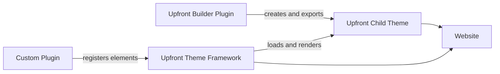

# Upfront Theme Framework

[Deutsch](README.md) | **English**

[](readme.txt)


[](https://www.gnu.org/licenses/gpl-2.0.html)

**The theme framework for custom ClassicPress and WordPress themes.**

Upfront provides the technical foundation on which Upfront themes run: layout resolution, responsive grids, regions, global design values, reusable elements, and interfaces for Child Themes and plugins.

The **Upfront Builder is a separate plugin**. It is used to create and edit themes visually and export them as Child Themes. This repository contains the framework that subsequently loads and renders those themes.

> **Project page, documentation, and showcase for Upfront themes:**
>
> [PS UpFront Theme Framework](https://psource.eimen.net/ps-upfront-theme-framework/)

[Source code on GitHub](https://github.com/Power-Source/upfront) · [Upfront documentation](https://psource.eimen.net/wiki/upfront-dokumentation/) · [PSOURCE](https://psource.eimen.net/)

## Upfront Architecture



### Upfront Theme Framework

The framework in this repository is both the Parent Theme and runtime. It handles:

- selecting the appropriate layout for pages, posts, archives, and system views,
- the responsive grid and breakpoint logic,
- regions, global regions, modules, and elements,
- theme colors, typography, presets, and layout properties,
- serving and managing local element assets,
- PHP, JavaScript, and AJAX interfaces for extensions,
- compatibility between Upfront Child Themes and the runtime environment.

The framework should not be modified for individual projects. Custom design belongs in a Child Theme, while additional application functionality belongs in plugins.

### Upfront Child Themes

A Child Theme contains the concrete design of a website. This can include layout definitions, settings, theme assets, and custom templates.

```text
my-upfront-theme/
├── style.css
├── functions.php
├── settings.php
├── layouts/
├── styles/
└── scripts/
```

The framework remains the shared technical foundation. A Child Theme can be developed manually or created and exported with the separate Upfront Builder.

### Upfront Builder Plugin

The Builder is the authoring tool for Upfront themes. It adds the visual interface and theme export functionality to the framework.

The Builder can be used to:

- visually design layouts and responsive breakpoints,
- create regions and global regions,
- place and configure elements,
- define colors, typography, and presets,
- prepare layouts for pages, posts, and archives,
- export completed designs as Upfront Child Themes.

The exported theme subsequently runs on the Upfront Theme Framework. The Builder should therefore not be considered part of the framework itself.

More information about how the components work together, available themes, and examples can be found on the [Upfront information page](https://psource.eimen.net/ps-upfront-theme-framework/).

## How the Framework Renders

1. Upfront determines the content type and appropriate layout specificity from the request.
2. The framework looks for the layout in the active Child Theme and stored layout data.
3. The layout is assembled from regions, modules, and elements.
4. PHP views generate the public markup for the elements.
5. The framework loads only the styles and scripts registered for the layout.
6. Theme settings and breakpoint rules are applied to the output.

This allows multiple Upfront themes to use the same runtime without duplicating framework logic.

## Included Elements

Upfront includes an extensive element library, including:

- text, image, gallery, slider, and YouTube,
- navigation, search, tabs, and accordion,
- buttons, spacers, and custom code,
- posts, post data, and comments,
- contact form, login, map, and widgets,
- social media and additional content components.

The implementations under [`elements/`](elements/) also serve as references for custom extensions.

## Integrating Custom Plugin Elements

Plugins can integrate custom elements with the Upfront Framework and, when installed, the Builder plugin. An element usually consists of:

- a loader in the plugin,
- a PHP view for frontend markup and default values,
- a JavaScript entity for its model and representation in the Builder,
- optional local styles, scripts, settings, and AJAX endpoints.

One possible plugin structure:

```text
acme-upfront-note/
├── acme-upfront-note.php
├── lib/
│   └── class-acme-upfront-note-view.php
└── assets/
    ├── css/note.css
    └── js/note.js
```

### Plugin Loader

The plugin registers itself with the `upfront-core-initialized` framework hook:

```php
<?php
/**
 * Plugin Name: ACME Upfront Note
 */

if (!defined('ABSPATH')) exit;

add_action('upfront-core-initialized', 'acme_upfront_note_register');

function acme_upfront_note_register() {
	if (!function_exists('upfront_add_layout_editor_entity')) return;

	require_once plugin_dir_path(__FILE__) . 'lib/class-acme-upfront-note-view.php';

	upfront_add_layout_editor_entity(
		'acme-note',
		plugins_url('assets/js/note', __FILE__)
	);

	add_action(
		'wp_enqueue_scripts',
		array('Acme_Upfront_Note_View', 'add_assets')
	);
}
```

The JavaScript URL is registered without `.js` because RequireJS loads the entity. The slug should be unique across the entire installation.

### PHP View

The PHP view describes the element for the framework runtime:

```php
<?php

class Acme_Upfront_Note_View extends Upfront_Object {

	public static function default_properties() {
		return array(
			'type' => 'AcmeNoteModel',
			'view_class' => 'Acme_Upfront_Note_View',
			'class' => 'c24 acme-upfront-note',
			'has_settings' => 0,
			'id_slug' => 'acme-note',
			'content' => __('Note text', 'acme-upfront-note'),
		);
	}

	public function get_markup() {
		$properties = array();
		foreach ($this->_data['properties'] as $property) {
			if (!isset($property['name'], $property['value'])) continue;
			$properties[$property['name']] = $property['value'];
		}

		$content = isset($properties['content']) ? $properties['content'] : '';
		return '<aside class="acme-note">' . esc_html($content) . '</aside>';
	}

	public static function add_assets() {
		wp_enqueue_style(
			'acme-upfront-note',
			plugins_url('../assets/css/note.css', __FILE__),
			array(),
			'1.0.0'
		);
	}
}
```

Element data must be escaped according to its output context. Assets should be stored locally in the plugin; no CDN dependency is required.

### JavaScript Entity for the Builder

The Builder entity uses the Upfront model and registers the same type as the PHP view:

```javascript
(function($) {
	define([], function() {
		var AcmeNoteModel = Upfront.Models.ObjectModel.extend({
			init: function() {
				this.init_property('type', 'AcmeNoteModel');
				this.init_property('view_class', 'Acme_Upfront_Note_View');
				this.init_property('element_id', Upfront.Util.get_unique_id('acme-note'));
				this.init_property('class', 'c24 acme-upfront-note');
				this.init_property('has_settings', 0);
				this.init_property('id_slug', 'acme-note');
				this.init_property('content', 'Note text');
			}
		});

		var AcmeNoteView = Upfront.Views.ObjectView.extend({
			model: AcmeNoteModel,
			get_content_markup: function() {
				return $('<div>').text(
					this.model.get_property_value_by_name('content') || ''
				).prop('outerHTML');
			}
		});

		Upfront.Application.LayoutEditor.add_object('AcmeNoteModel', {
			Model: AcmeNoteModel,
			View: AcmeNoteView
		});
	});
})(jQuery);
```

Without the Builder, the PHP view remains responsible for rendering stored or exported layouts. The JavaScript entity is required for visually editing and inserting the element.

More complex plugin elements can also:

- provide localized strings through `upfront_l10n`,
- register custom settings panels and fields,
- add AJAX actions with `upfront_add_ajax()`,
- support presets and responsive properties,
- subscribe to or trigger events through `Upfront.Events`,
- load frontend assets only when they are actually used.

Small Core elements such as Spacer and Button are useful references. Gallery, Posts, and Navigation demonstrate more extensive data, settings, and rendering paths.

## Installation and Usage

1. Install the `upfront` directory under `wp-content/themes/`.
2. Use Upfront as the Parent Theme for a compatible Child Theme.
3. Activate an existing Upfront theme or use the separate Builder plugin to create and export a custom theme.
4. Install additional Upfront elements as plugins when required.

Themes and usage examples are linked in the [Upfront showcase](https://psource.eimen.net/ps-upfront-theme-framework/).

## Framework Development

Requirements:

- Node.js 20 or newer
- npm
- PHP and a local ClassicPress or WordPress installation
- WP-CLI with `wp i18n make-pot`

```bash
npm install
npm run build-css
npm run lint
npm run test-js
npm run test-php
./scripts/build-i18n.sh
```

| Command | Purpose |
| --- | --- |
| `npm run build-css` | Compile Sass and minimize CSS artifacts |
| `npm run lint` | Check JavaScript syntax with ESLint |
| `npm run test-js` | Run JavaScript tests |
| `npm run test-php` | Run PHP tests |
| `./scripts/build-i18n.sh` | Regenerate POT, update PO, and compile MO |
| `npm test` | Run PHP and JavaScript tests together |

Production framework and element assets are delivered locally. Changes to SCSS sources should be committed together with the generated CSS files.

## Links

- [Framework information page and theme showcase](https://psource.eimen.net/ps-upfront-theme-framework/)
- [Upfront documentation](https://psource.eimen.net/wiki/upfront-dokumentation/)
- [Builder plugin documentation](https://psource.eimen.net/wiki/upfront-dokumentation/upfront-builder-dokumentation/)
- [GitHub repository](https://github.com/Power-Source/upfront)
- [PSOURCE](https://psource.eimen.net/)

## License

Upfront is released under the [GNU General Public License v2 or later](https://www.gnu.org/licenses/gpl-2.0.html).